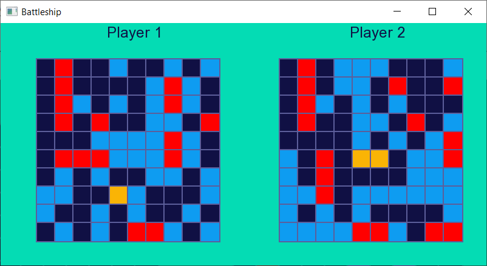

# Battleship
C++/SFML game

# Getting Started
Requirements: Visual Studio 2019 tested only.
Supported only 64 bit SFML version.

`git clone https://github.com/kryvytskyidenys/Battleship`

# Features
- Two players mode
- Single player mode (versus simple AI)
- Console menu

# Screenshots

